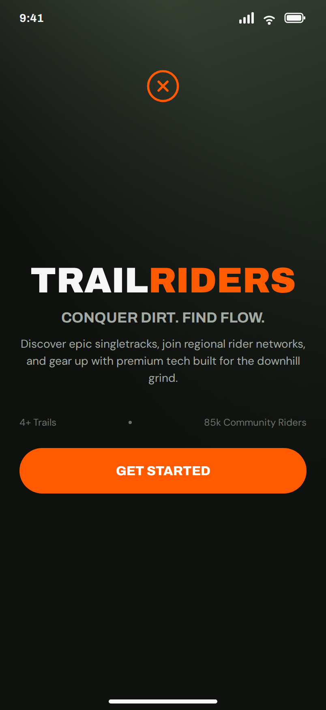

# 2. SignIn, from the home screen

No em dashes anywhere in this document or any copy it generates.

Your Figma frame is called `home` and your architecture calls this form
`SignIn`, and they are the same screen: the one you see before you are
anybody. The frame needs renaming, and the designer's list on the README says
so. This page is the builder's half.

Your architecture gives this form exactly one component, `btn_sign_in`, and
Pattern 12 to make it work. The design puts a photo, a logo, three lines of
text and a button on top of that. Here is what each one is.

## The photo

The whole top of the screen is a photo of a rider in a forest, fading to
black at the bottom. Two honest choices:

- **Have it.** The designer exports the photo as a PNG, it is uploaded as an
  asset, and an **Image** component called `img_hero` sits at the top of the
  form. The fade is a CSS trick and you will not get it; the photo will have a
  hard bottom edge. That is fine.
- **Skip it.** A dark screen with the orange name on it looks like the design
  from across the room. Nobody loses marks for this.

Do whichever takes less than five minutes.

## The words and the button

Everything below the photo stacks down the page, centred, which is what a
ColumnPanel does on its own.

| Name | Type | Text | Look |
|---|---|---|---|
| `lbl_logo` | Label | | icon `fa:times-circle-o`, foreground Primary, align center. Optional; it is the small orange circle at the top. |
| `lbl_brand` | Label | `TRAILRIDERS` | role `display`, **44**, foreground On Surface, align center. In the design the first five letters are white and RIDERS is orange. A Label is one colour throughout, so either all white, or all orange, or two Labels side by side in a FlowPanel. All orange is the easiest and looks right. |
| `lbl_tagline` | Label | `CONQUER DIRT. FIND FLOW.` | role `strong`, 18, foreground `#a3aaa3`, align center |
| `lbl_blurb` | Label | `Discover epic singletracks, join regional rider networks, and gear up with premium tech built for the downhill grind.` | 14, foreground `#a3aaa3`, align center |
| `btn_sign_in` | Button | `GET STARTED` | role `pill`, background Primary, foreground On Primary, full width |

The line under the blurb, *4+ Trails • 85k Community Riders*, is two numbers
the design tool made up. Leave it off, or make it true: a Label whose text is
how many rows are in your `trails` table, which is Pattern 8 and one line.
Page 7 has the rest of the invented numbers.

## What the button does

Pattern **12**. Your story says *When I submit my email and username, Then I
am approved and able to explore the app*. Anvil's sign in form asks for an
email and a password, and that is what you build. Username is a decision for
your team: the sign in form does not have one, and adding it is not in the
slice.

When sign in succeeds, Pattern **4** to `Trails`, because that is the screen
your architecture builds first and the one a rider came for.

## The three states

The design draws one. The other two:

- **Empty.** This screen has no list, so empty is the screen itself. Done.
- **Wrong.** A wrong password. Anvil's sign in form handles that by itself
  and says so in its own box. Nothing to draw and nothing to build.
- **Full.** A rider who is already signed in should not see this screen. On
  load, if `anvil.users.get_user()` returns somebody, go straight to `Trails`.
  That is Pattern 6 around Pattern 4, and it is three lines.

## The designer's layers on this frame

| Figma layer | Rename to |
|---|---|
| `home` (the frame) | `SignIn` |
| `title` | `lbl_brand` |
| `tagline` | `lbl_tagline` |
| `description` | `lbl_blurb` |
| `cta-get-started` | `btn_sign_in` |
| `cta-label` | delete, or leave; the button's text is the button's text |
| `hero-background-wrapper` | `img_hero` |
| `brand-trust-row` and the two `stat` layers | delete, unless the team decides to make the numbers real |
| `status-bar`, `home-indicator-container` | leave; they are the phone, not the app |
