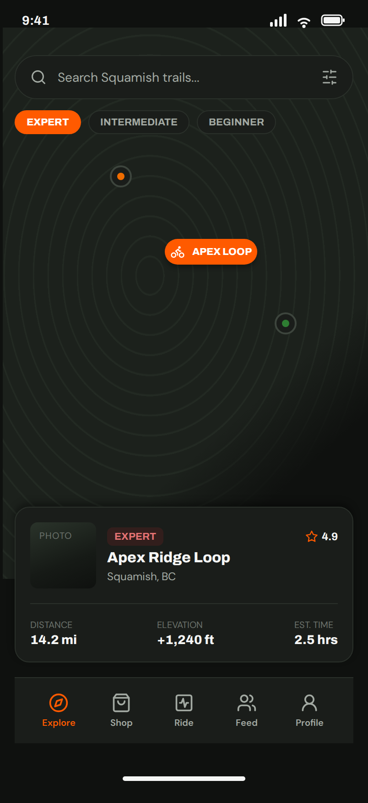
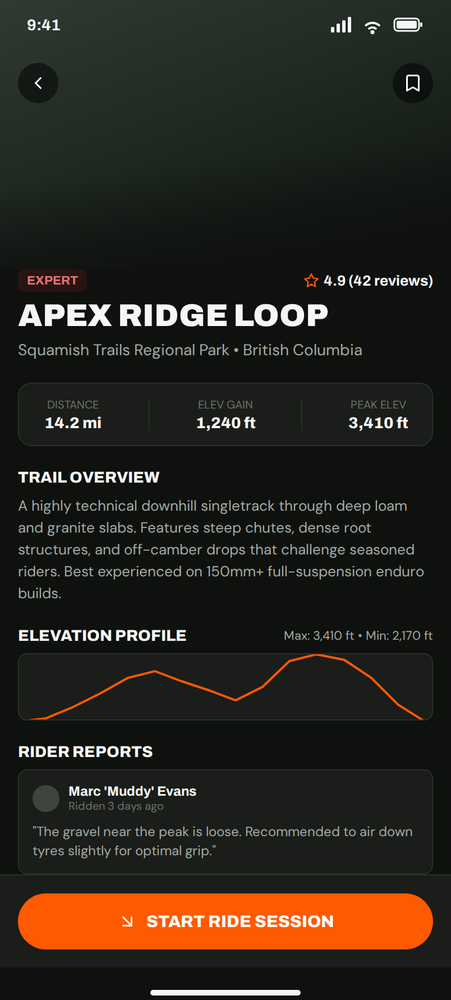

# 3. Trails and TrailDetail, from the map and the detail screen

No em dashes anywhere in this document or any copy it generates.



Two forms, `Trails` and `TrailDetail`, and one row form, `TrailRow`. Your
architecture already has `rp_trails` with `lbl_trail_name`, `lbl_difficulty`
and `lbl_length`; the design adds a location line, a rating, and a card to
put them in. Your architecture also already made the decision this page
depends on: **the map is a list for now.** Here is why that costs you almost
nothing.

## The map is a list

Look at the bottom of the map screen. Under the map there is a card: a
thumbnail, an EXPERT badge, a rating, the trail name, where it is, and three
numbers. **That card is your row.** The map above it is a picture of a place
the card already describes. Take the map away and stack five of those cards
and you have the `Trails` screen, and it has everything your story asks for:
name, difficulty, and *the length appears with the trail name*.

The search bar and the three difficulty chips at the top can stay, and page 7
says what they cost. Start without them.

## Trails: the top

| Name | Type | Text | Look |
|---|---|---|---|
| `lbl_title` | Label | `TRAILS` | role `display`, 28, foreground On Surface |
| `rp_trails` | RepeatingPanel | | item template `TrailRow` |

That is the whole form. The work is in the row.

## TrailRow

One ColumnPanel called `card_trail`, role `card-big`, with the thumbnail on
the left and the words on the right. Drag the words next to the thumbnail
rather than under it, and Anvil puts them in one row.

| Name | Type | Text | Look |
|---|---|---|---|
| `img_trail` | Image | | 72 by 72, optional. Your `trails` table has no photo column, so leave this out until it does. |
| `lbl_difficulty` | Label | `EXPERT` | role `chip-expert` when the difficulty is Expert, role `chip` otherwise. The code for that is below. |
| `lbl_rating` | Label | `4.9` | icon `fa:star` in Primary, role `strong`, 12, align right. Optional: there is no ratings column either. |
| `lbl_trail_name` | Label | `Apex Ridge Loop` | role `strong`, 16, foreground On Surface |
| `lbl_location` | Label | `Squamish, BC` | 12, foreground `#a3aaa3`. Optional, and it needs a column. |
| `lbl_length_word` | Label | `DISTANCE` | role `eyebrow` |
| `lbl_length` | Label | `14.2 mi` | role `strong`, 14, foreground On Surface |

The design shows three numbers across the bottom: distance, elevation and
time. Your table has one of them, length. Show one. Two empty boxes next to a
real one look worse than one real one on its own.

The row fills itself in `__init__` from `self.item`, which is Pattern 9, and
this is the one place the look depends on the data:

```python
self.lbl_difficulty.text = self.item['difficulty'].upper()
if self.item['difficulty'] == 'Expert':
    self.lbl_difficulty.role = 'chip-expert'
else:
    self.lbl_difficulty.role = 'chip'
```

Clicking the row opens the trail. A Label cannot be clicked, so either make
`lbl_trail_name` a **Link** instead, or put a small Button in the row. The
Link is closer to the design. Then Pattern **1** and **4**, passing the row's
trail along.

## TrailDetail



The design's hero photo at the top is the same choice as page 2: an Image if
the table has a photo, nothing if it does not. Below it, everything stacks
down the page.

| Name | Type | Text | Look |
|---|---|---|---|
| `lnk_back` | Link | `Back` | icon `fa:chevron-left`, foreground `#a3aaa3` |
| `lbl_difficulty` | Label | `EXPERT` | role `chip-expert` or `chip`, same code as the row |
| `lbl_rating` | Label | `4.9 (42 reviews)` | icon `fa:star` in Primary, role `strong`, 13, align right. Optional. |
| `lbl_name` | Label | `APEX RIDGE LOOP` | role `display`, 28 |
| `lbl_location` | Label | `Squamish Trails Regional Park • British Columbia` | 14, foreground `#a3aaa3`. Optional. |
| `card_stats` | ColumnPanel | | role `card`, one row, two things across |
| `lbl_length_word` | Label, inside | `DISTANCE` | role `eyebrow`, align center |
| `lbl_length` | Label, inside | `14.2 mi` | role `strong`, 14, align center |
| `lbl_improves_word` | Label, inside | `IMPROVES` | role `eyebrow`, align center |
| `lbl_improves` | Label, inside | `Core, legs` | role `strong`, 14, align center |
| `lbl_overview_word` | Label | `TRAIL OVERVIEW` | role `heading` |
| `lbl_overview` | Label | the description | 13, foreground `#a3aaa3` |
| `lbl_reviews_word` | Label | `RIDER REPORTS` | role `heading` |
| `rp_reviews` | RepeatingPanel | | item template `ReviewRow` |

**`lbl_improves` is not in the Figma and it is in your story.** *Then I will be
able to see the difficulty, reviews, and what the trail improves (core, legs,
etc.)* The design's stats panel has Distance, Elev Gain and Peak Elev, and
your table has `length` and `improves`. Build what the table has. The
designer's list on the README asks them to add it.

**The overview needs a column.** Your plan says *descriptions of the trails
made by bikers* and your `trails` table has no description. Add one,
`description`, text. Page 7 lists it with the other things to add to the
architecture page.

**The elevation profile** is a drawn line. There is no component for it and
the two numbers under it, max and min, are not in your table. Leave it out.

**Start Ride Session** at the bottom is the ride tracking feature, which has
no story. Leave it off. A button that does nothing is a bug somebody will
report.

## ReviewRow

Your design brief said *your architecture does not say what goes in each
row*. The Figma has now decided, and it is a good decision:

| Name | Type | Text | Look |
|---|---|---|---|
| `card_review` | ColumnPanel | | role `card` |
| `lbl_reviewer` | Label | `Marc 'Muddy' Evans` | icon `fa:user-circle-o`, bold, 12, foreground On Surface |
| `lbl_when` | Label | `Ridden 3 days ago` | 10, foreground `#6b726b` |
| `lbl_review` | Label | the review, in quotes | 12, foreground `#a3aaa3` |

That needs a `reviews` table your architecture does not have: `trail` (a link
to the trails row), `reviewer`, `posted` (date and time), `text`. Reading them
for one trail is Pattern 8 with a condition, and Pattern 9 to show them.

## The three states

- **Empty.** No trails yet: `rp_trails` shows nothing, and a Label under it
  that says `No trails yet. Ask a rider to add one.` which is visible only
  when the list is empty, Pattern 14. No reviews yet on a trail: the same,
  `Nobody has reported on this trail yet.`
- **Wrong.** Nothing is typed on either screen, so nothing can be wrong.
- **Full.** A trail name of six words wraps onto two lines in the card and
  that is fine. A review that is a paragraph makes its card tall and that is
  also fine. Try both before you call the screen done.

## The designer's layers on these frames

| Figma layer | Rename to |
|---|---|
| `trail-map` (the frame) | `Trails` |
| `preview-card` | `rp_trails`, and make it a component: it is the row |
| `trail-title` | `lbl_trail_name` |
| `difficulty-badge` | `lbl_difficulty` |
| `trail-location` | `lbl_location` |
| the first `spec-val` (14.2 mi) | `lbl_length` |
| `trail-thumbnail` | `img_trail` |
| `topo-map-bg`, the three markers | move to the Later page, with a note that the map comes back when there is a map service |
| `trail-detail` (the frame) | `TrailDetail` |
| `btn-back` | `lnk_back` |
| `title` | `lbl_name` |
| `location` | `lbl_location` |
| `overview-body` | `lbl_overview` |
| the `stat` with Elev Gain | `lbl_improves`, with the words changed to IMPROVES and Core, legs |
| the `stat` with Peak Elev | delete |
| `review-card-0` | `rp_reviews`, and make it a component |
| `reviewer-name`, `review-time`, `review-text` | `lbl_reviewer`, `lbl_when`, `lbl_review` |
| `elevation-profile-block` | move to Later |
| `btn-start-ride` | move to Later |
| `btn-save` (the bookmark) | delete, or write the story for saving a trail |
