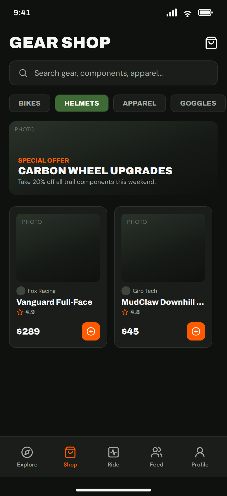

# 4. Shop, and NewListing which is not drawn yet

No em dashes anywhere in this document or any copy it generates.

One form, `Shop`, one row form, `ListingRow`, and one form the Figma does
not have, `NewListing`. Your architecture has `rp_listings` with `lbl_item`
and `lbl_price`, plus `btn_new_listing`. The design has a store.

## This is a different shop from the one in your plan

Read your own plan: *a shop similar to Facebook Marketplace, where people post
listings for bikes, helmets, parts and so on*, and *cash on pickup*. Your
seller story is somebody selling a bike they do not want. Your buyer story
ends with meeting up.

The Figma is a retail store. The sellers are Fox Racing and Giro Tech, the
cards have a star rating and an **Add to cart** button, and there is a Special
Offer banner for 20% off carbon wheels. That is a good screen for a different
app, and it is not what your stories say, and your stories are what the code
is built from.

So the shop your builder builds is the one on your architecture page: a list
of things riders are selling, each with what it is, the price, who is selling
it, and a way to post one. The design's card is still the right shape for
that. What changes is the words, and what the button does.

## Shop: the top

| Name | Type | Text | Look |
|---|---|---|---|
| `lbl_title` | Label | `GEAR SHOP` | role `display`, 28 |
| `btn_new_listing` | Button | `SELL SOMETHING` | icon `fa:plus`, role `pill`, background Primary, foreground On Primary |
| `rp_listings` | RepeatingPanel | | item template `ListingRow` |

**`btn_new_listing` is on your architecture and not in the Figma.** The
closest thing the design has is the orange plus button floating on the feed
screen. That shape, at the top of the shop, is the button. The designer's
list on the README asks them to draw it.

The search bar and the four category tabs, BIKES, HELMETS, APPAREL, GOGGLES,
are optional and page 7 says what they cost. The four category names, though,
are worth keeping: they are your `dd_category` choices on `NewListing`.

The Special Offer banner is a store's thing. Leave it out.

## ListingRow

The design shows the listings two across in a grid. A RepeatingPanel is one
column, and one column is also how the design's own **Recent Rides** list on
the profile screen works: a small thumbnail on the left, two lines of text,
a number on the right. Use that shape. It is the same components in a row
rather than a stack.

| Name | Type | Text | Look |
|---|---|---|---|
| `card_listing` | ColumnPanel | | role `card`, one row, three things across |
| `img_item` | Image | | 72 by 72, optional; see photos below |
| `lbl_item` | Label | `Vanguard Full-Face` | role `strong`, 14, foreground On Surface |
| `lbl_seller` | Label | `Fox Racing`, which in your app is a rider's name | icon `fa:user-circle-o`, 10, foreground `#a3aaa3` |
| `lbl_category` | Label | `Helmets` | role `chip`. Optional. |
| `lbl_price` | Label | `$289` | role `display`, 16, align right |

**The Add to cart button is not built.** There is no cart: your buyer meets
the seller and pays cash. What the buyer needs is a way to contact the
seller, and your build card 3 says so: *You can see how to contact the
seller.* Nobody has written the messaging story yet, so the smallest true
version is that clicking the row shows the seller's name and how to reach
them, which is Pattern 5. When the messaging story is written, that click
opens the conversation instead.

**Photos.** Your seller story says *you need proof, a photo or a receipt*, and
your `listings` table has no photo column. Adding one means a FileLoader
component on `NewListing` and a Media column on the table, which the Pattern
Book does not cover yet. Decide whether the photo is in the slice. If it is
not, the row has no thumbnail and looks like the Recent Rides list without
the icon, which is fine.

The rating on each card, `4.9`, is a store's thing. Leave it out.

## NewListing, which needs drawing

There is no frame for this and your architecture has all five components
for it. Both the designer and the builder work from this table, and the
designer draws it in the same style as the shop: dark, one card, one orange
pill.

| Name | Type | Text | Look |
|---|---|---|---|
| `lnk_back` | Link | `Back` | icon `fa:chevron-left`, foreground `#a3aaa3` |
| `lbl_title` | Label | `SELL YOUR GEAR` | role `display`, 28 |
| `lbl_item_word` | Label | `WHAT IS IT` | role `eyebrow` |
| `txt_item` | TextBox | placeholder `Vanguard full-face helmet, size M` | role `field` |
| `lbl_price_word` | Label | `PRICE` | role `eyebrow` |
| `txt_price` | TextBox | placeholder `45` | role `field`. Set its type to number. |
| `lbl_category_word` | Label | `CATEGORY` | role `eyebrow` |
| `dd_category` | DropDown | items `Bikes`, `Helmets`, `Apparel`, `Goggles`, `Parts` | role `field` |
| `lbl_error` | Label | starts empty and invisible | role `chip-expert`, so it is red text on the red tint. Full width. |
| `btn_post` | Button | `POST LISTING` | role `pill`, background Primary, foreground On Primary, full width |

The categories are the four tabs from the shop screen, plus Parts because
your plan says *bikes, helmets, parts and so on*.

**What `btn_post` does** is on your architecture page as Feature 4: Patterns
1, 2, 13, 6, 7, 5, 4, in that order, and the checks are your own criteria: a
signed in rider, an item, a price. Each failed check puts a sentence in
`lbl_error` and makes it visible, which is Pattern 14. Some sentences to use,
so the designer can draw the real one:

- `You need to sign in before you can sell.`
- `Say what you are selling.`
- `Put a price on it, in dollars.`

## The three states

- **Empty.** A shop with no listings. `rp_listings` shows nothing, and a Label
  under it says `Nothing for sale yet. Be the first.` visible only when the
  list is empty. The `SELL SOMETHING` button is right there above it, which
  is the point.
- **Wrong.** `NewListing` with `lbl_error` showing one of the three sentences.
  The designer draws this state; the builder tests it by pressing Post with
  everything blank.
- **Full.** Forty listings, a long item name, a price of `$1,850`. The row
  shape above handles all three. Try it.

## The designer's layers on this frame

| Figma layer | Rename to |
|---|---|
| `shop` (the frame) | `Shop` |
| `shop-title` | `lbl_title` |
| `product-card-0` | `rp_listings`, and make it a component; delete `product-card-1` |
| `prod-title` | `lbl_item` |
| `price` | `lbl_price` |
| `merchant-name` | `lbl_seller`, and change the words to a rider's name |
| `prod-img` | `img_item` |
| `btn-add-cart` | delete |
| `rating-row` | delete |
| `store-banner-wrapper` | delete, or move to Later |
| `categories-tab-row` | keep, or move to Later; the names go into `dd_category` either way |
| the feed screen's `fab-new-post` | copy it here, name it `btn_new_listing` |
| a new frame | `NewListing`, drawn from the table above |
