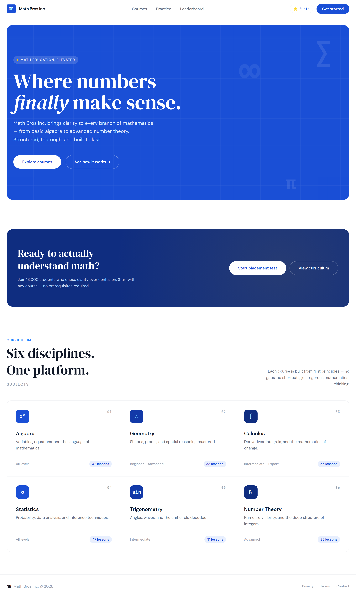
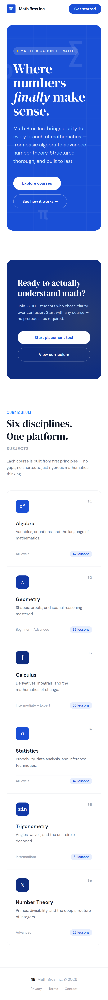

# 2. Home

No em dashes anywhere in this document or any copy it generates.



The busiest screen in the app, and the one that sets the tone. Five bands, top
to bottom: a nav bar, the blue hero, the navy call to action, the six subjects,
and a footer. Build them in that order, as five things stacked down a
ColumnPanel, and run after each one.

On a phone the same screen stacks: the six subjects become a single column and
the two hero buttons wrap. That is what an Anvil ColumnPanel does by itself, so
the phone version costs you nothing.



## The nav bar

One row of a ColumnPanel with three things on it, side by side. Drag the
second and third next to the first rather than under it, and Anvil puts them
in one row.

| Name | Type | Text | Look |
|---|---|---|---|
| `lbl_brand` | Label | `Math Bros Inc.` | bold, 15, foreground On Surface. Optional: an icon of `fa:square` in Primary in front, standing in for the "MB" square. |
| `fp_nav` | FlowPanel | | in the middle, holding the two links |
| `lnk_practice` | Link, inside `fp_nav` | `Practice` | foreground `#6b7280`, 14 |
| `lnk_leaderboard` | Link, inside `fp_nav` | `Leaderboard` | foreground `#6b7280`, 14 |
| `fp_nav_right` | FlowPanel | | align right, holding the next two |
| `lbl_points` | Label, inside `fp_nav_right` | `⭐ 0 pts` | role `mono` and `chip`, foreground Primary, 12 |
| `btn_get_started` | Button, inside `fp_nav_right` | `Get started` | role `pill`, background Primary, foreground On Primary, 14 |

Under it, the design has a one pixel line the colour of the card border. A
Spacer of height 1 with background `#f3f4f6` does it, or skip it.

The design also has a **Courses** link. It goes nowhere in the Figma. Leave it
off; page 7 says why.

## The blue hero

A ColumnPanel called `card_hero`, role `panel`, background Primary. Everything
inside it is white text.

| Name | Type | Text | Look |
|---|---|---|---|
| `lbl_hero_eyebrow` | Label | `MATH EDUCATION, ELEVATED` | role `eyebrow`, foreground On Primary, 12. Optional: icon `fa:circle` in `#f5b800` for the yellow dot. |
| `lbl_hero_headline` | Label | `Where numbers finally make sense.` | role `display`, foreground On Primary, **64** |
| `lbl_hero_text` | Label | `Math Bros Inc. brings clarity to every branch of mathematics, from basic algebra to advanced number theory. Structured, thorough, and built to last.` | foreground `#dbeafe`, 18 |
| `fp_hero_buttons` | FlowPanel | | spacing large |
| `btn_explore` | Button, inside | `Explore courses` | role `pill`, background On Primary, foreground Primary |
| `btn_how` | Button, inside | `See how it works →` | role `pill-outline`, foreground On Primary |

The word **finally** is in italic serif in the design. A Label is one font
style all the way through, so either accept it upright, or make it three
labels in a FlowPanel with the middle one italic. The first is fine. This is
exactly the kind of five percent the README warns about.

The faint grid and the floating ∑, π and ∞ in the corners are decoration drawn
with CSS. Skip them. Nobody will miss them and there is no component for them.

## The navy call to action

A second ColumnPanel, `card_cta`, role `panel`, background Secondary (that is
`#0f2d80`, the dark blue). The design puts the words on the left and the
buttons on the right; on a ColumnPanel that means dropping `fp_cta_buttons` on
to the same row as the text, or simply stacking them, which is what the phone
does anyway.

| Name | Type | Text | Look |
|---|---|---|---|
| `lbl_cta_heading` | Label | `Ready to actually understand math?` | role `display`, foreground On Primary, 36 |
| `lbl_cta_text` | Label | `Join 18,000 students who chose clarity over confusion. Start with any course, no prerequisites required.` | foreground `#bfdbfe`, 14 |
| `fp_cta_buttons` | FlowPanel | | |
| `btn_placement` | Button, inside | `Start placement test` | role `pill`, background On Primary, foreground Primary |
| `btn_curriculum` | Button, inside | `View curriculum` | role `pill-outline`, foreground On Primary |

**`btn_placement` is the one that matters.** It opens the placement test, and
it is the only button on this screen that the Figma actually wires up. About
the 18,000 students, see page 7.

## The six subjects

| Name | Type | Text | Look |
|---|---|---|---|
| `lbl_curriculum` | Label | `CURRICULUM` | role `eyebrow`, foreground `#3b82f6` |
| `lbl_subjects_heading` | Label | `Six disciplines. One platform.` | role `display`, foreground On Surface, 44 |
| `lbl_subjects_sub` | Label | `SUBJECTS` | role `eyebrow`, foreground `#9ca3af` |
| `lbl_subjects_text` | Label | `Each course is built from first principles: no gaps, no shortcuts, just rigorous mathematical thinking.` | foreground `#6b7280`, 14 |
| `rp_subjects` | RepeatingPanel | | item template `SubjectRow`, below |

The design lays the six out as a three by two grid. **A RepeatingPanel stacks
its rows in one column.** So on a laptop your list will look like the phone
picture rather than the grid, and that is the right call: it is one row form,
designed once, and it is the same row form the Practice screen uses. If your
team wants the grid badly, that is six copies of the row placed by hand, three
to a line, and it stops being a list.

### `SubjectRow`

The item template. Its own form, with a ColumnPanel called `card_subject` of
role `card` holding everything.

| Name | Type | Text | Look |
|---|---|---|---|
| `fp_subject` | FlowPanel | | the top line |
| `lbl_subject_icon` | Label, inside | `x²` | role `subject-icon`, background Primary. Or just bold Primary text if you skip that role. |
| `lnk_subject` | Link, inside | `Algebra` | bold, 18, foreground On Surface. Clicking it opens the quiz. |
| `lbl_subject_tag` | Label, inside | `01` | role `mono`, foreground `#9ca3af`, align right |
| `lbl_subject_description` | Label | `Variables, equations, and the language of mathematics.` | foreground `#6b7280`, 14 |
| `fp_subject_foot` | FlowPanel | | the bottom line |
| `lbl_subject_level` | Label, inside | `All levels` | foreground `#9ca3af`, 12 |
| `lbl_subject_lessons` | Label, inside | `42 lessons` | role `chip`, background Primary Container, foreground Primary, 12 |

In code, each row fills itself from its own row of data, which is Pattern 9:

```python
self.lbl_subject_icon.text = self.item['icon']
self.lnk_subject.text = self.item['name']
self.lbl_subject_tag.text = self.item['tag']
self.lbl_subject_description.text = self.item['description']
self.lbl_subject_level.text = self.item['level_text']
self.lbl_subject_lessons.text = f"{self.item['lessons']:.0f} lessons"
```

The `:.0f` is there because a Number column hands you `42.0`, and "42.0
lessons" is the kind of thing nobody notices until a parent does.

The six subjects, exactly as the design has them, so you can type them into a
table or a list:

| tag | icon | name | description | level_text | lessons |
|---|---|---|---|---|---|
| 01 | x² | Algebra | Variables, equations, and the language of mathematics. | All levels | 42 |
| 02 | △ | Geometry | Shapes, proofs, and spatial reasoning mastered. | Beginner to Advanced | 38 |
| 03 | ∫ | Calculus | Derivatives, integrals, and the mathematics of change. | Intermediate to Expert | 55 |
| 04 | σ | Statistics | Probability, data analysis, and inference techniques. | All levels | 47 |
| 05 | sin | Trigonometry | Angles, waves, and the unit circle decoded. | Intermediate | 31 |
| 06 | ℕ | Number Theory | Primes, divisibility, and the deep structure of integers. | Advanced | 28 |

## The footer

| Name | Type | Text | Look |
|---|---|---|---|
| `lbl_footer` | Label | `MB   Math Bros Inc. © 2026` | foreground `#9ca3af`, 14 |

The Privacy, Terms and Contact links go nowhere. Leave them off.

## The three states

**Empty.** There is nothing empty on this screen; the six subjects are fixed.
The points badge says `⭐ 0 pts` for a brand new student, which is the design's
own empty state and it is fine.

**Wrong.** Nothing to get wrong here. If your Home asks for a name before
Practice or the leaderboard will work, the place the design does not have a
message for is an empty name; an `alert("Type your name first.")` is the
honest answer.

**Full.** A student with a lot of points: `⭐ 1,240 pts`. The badge grows and
the FlowPanel copes. The `:,` in `f"⭐ {points:,.0f} pts"` puts the comma in.

## Test it

1. Run it next to `01-home.png`. Same five bands, same order.
2. The two buttons in the hero are white and blue; the two in the navy card
   are white and blue; the one in the nav is blue and white. Three pills,
   two looks.
3. Make the window narrow. The subjects stack, the buttons wrap, nothing
   overflows sideways.
4. Press **Start placement test**. Page 3.
