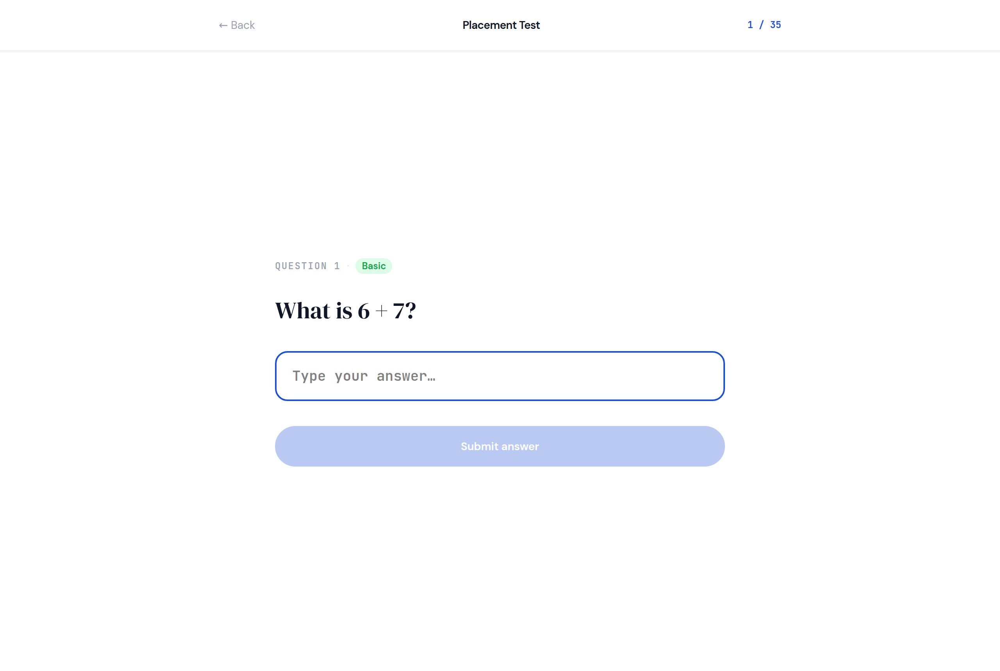
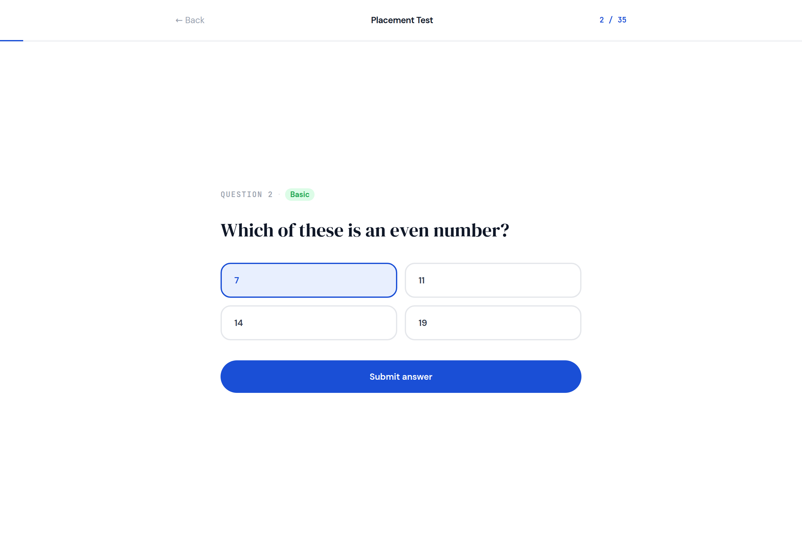
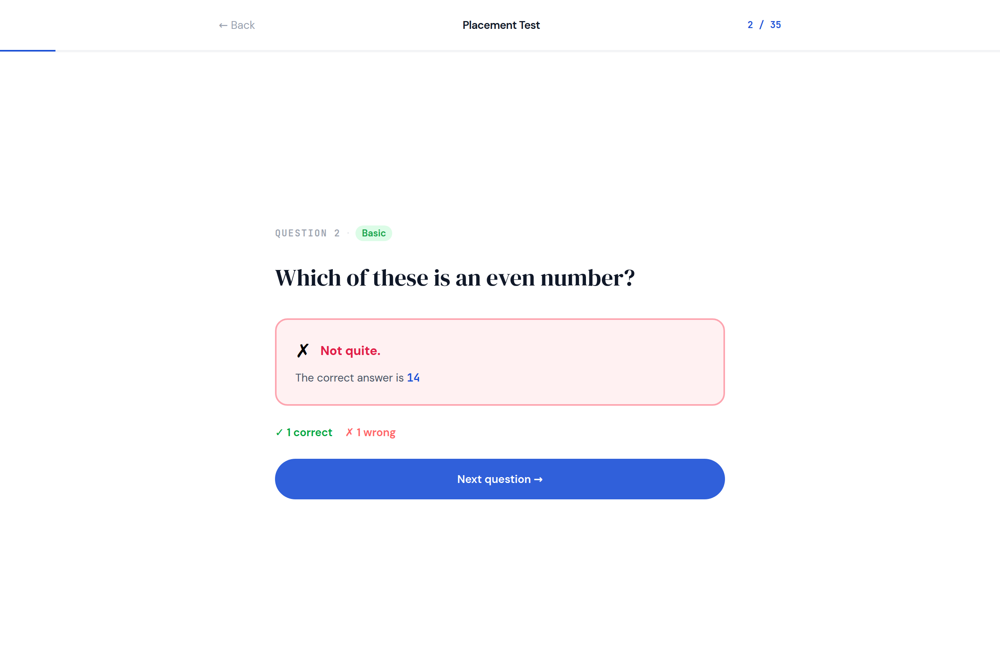
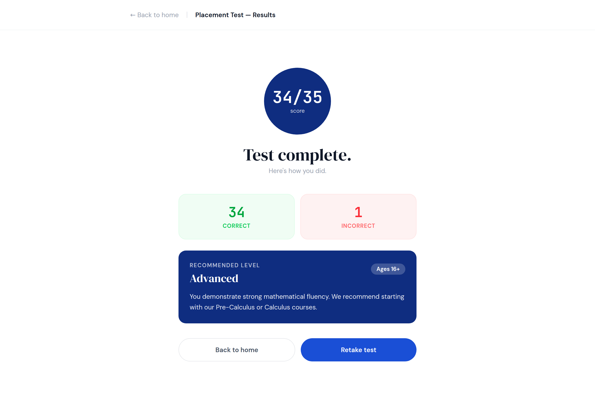

# 3. Placement test, and its results

No em dashes anywhere in this document or any copy it generates.



Two forms: `Placement`, which asks 35 questions one at a time, and
`PlacementResults`, which is the screen at the end. The design does them as
one component with two modes; in Anvil they are two forms, because one frame
is one screen and that is the rule on your design brief.

Everything in the middle of the page sits in a ColumnPanel called `card_body`
with the optional role `narrow`, which holds it at 640 wide in the centre. If
you skip that role the same components go edge to edge, which is how the phone
picture looks anyway.

## Placement: the nav

One row, three things across.

| Name | Type | Text | Look |
|---|---|---|---|
| `lnk_back` | Link | `← Back` | foreground `#9ca3af`, 14, align left |
| `lbl_title` | Label | `Placement Test` | bold, 14, align center |
| `lbl_progress` | Label | `2 / 35` | role `mono`, foreground Primary, 12, align right |

Under it the design has a two pixel bar that fills from left to right as you
go. There is no bar component. `lbl_progress` says the same thing in numbers,
and that is what you build.

## Placement: the question

| Name | Type | Text | Look |
|---|---|---|---|
| `fp_badge` | FlowPanel | | one line, two small things |
| `lbl_question_number` | Label, inside | `QUESTION 2` | role `eyebrow` and `mono`, foreground `#9ca3af` |
| `lbl_difficulty` | Label, inside | `Basic` | role `chip`. Its colours change with the difficulty, below. |
| `lbl_question` | Label | `Which of these is an even number?` | role `display`, foreground On Surface, 30 |
| `txt_answer` | TextBox | placeholder `Type your answer…` | role `answer` (optional), role `mono`, 18 |
| `dd_choice` | DropDown | | role `answer` (optional), 16 |
| `btn_submit` | Button | `Submit answer` | role `pill`, background Primary, foreground On Primary, full width |

**Only one of `txt_answer` and `dd_choice` is visible at a time.** A written
question shows the box; a multiple choice question shows the dropdown. That is
Pattern 14, and it is the one thing on this screen that changes shape:

```python
if question['choices']:
    self.dd_choice.items = question['choices'].split("|")
    self.dd_choice.selected_value = None
    self.dd_choice.visible = True
    self.txt_answer.visible = False
else:
    self.txt_answer.text = ""
    self.txt_answer.visible = True
    self.dd_choice.visible = False
```

The design shows the four choices as a two by two grid of boxes and turns the
chosen one blue. Four side by side buttons that each remember whether they are
picked is a lot of code for a look. A DropDown does the same job in one
component, and your story only asks that *students can select from multiple
choices*.



### The difficulty chip

Five difficulties, five colour pairs, taken straight from the design:

```python
DIFFICULTY = {
    1: ("Basic",       "#dcfce7", "#16a34a"),
    2: ("Pre-Algebra", "#dcfce7", "#16a34a"),
    3: ("Algebra",     "#fef9c3", "#ca8a04"),
    4: ("Advanced",    "#ffedd5", "#ea580c"),
    5: ("Expert",      "#fee2e2", "#dc2626"),
}

name, back, fore = DIFFICULTY[int(question['difficulty'])]
self.lbl_difficulty.text = name
self.lbl_difficulty.background = back
self.lbl_difficulty.foreground = fore
```

**`int(...)` is not optional.** A Number column gives you `2.0`, and a
dictionary has no key `2.0`, so without it you get `KeyError: 2.0` on the first
question and it looks like the table is wrong. The table is fine. It is the
decimal point.

## Placement: after you answer



The box and the submit button go away and three things appear in their place.

| Name | Type | Text | Look |
|---|---|---|---|
| `card_feedback` | ColumnPanel | | role `correct` or `wrong`, set from code |
| `lbl_feedback_title` | Label, inside | `✓  Correct!` or `✗  Not quite.` | bold, 16, foreground green or red |
| `lbl_feedback_answer` | Label, inside | `The correct answer is 14` | foreground `#4b5563`, 14. Only shown on a wrong answer. |
| `lbl_score` | Label | `✓ 1 correct   ✗ 1 wrong` | bold, 14. Two colours in one label is not a thing; use `#374151`, or make it two labels in a FlowPanel. |
| `btn_next` | Button | `Next question →`, or `See results` on the last one | role `pill`, background Primary, foreground On Primary, full width |

All of that is one method, and both screens with a question on them use it, so
it is worth writing well once:

```python
def show_feedback(self, was_right, answer):
    if was_right:
        self.card_feedback.role = "correct"
        self.lbl_feedback_title.text = "✓  Correct!"
        self.lbl_feedback_title.foreground = "#16a34a"
        self.lbl_feedback_answer.visible = False
    else:
        self.card_feedback.role = "wrong"
        self.lbl_feedback_title.text = "✗  Not quite."
        self.lbl_feedback_title.foreground = "#e11d48"
        self.lbl_feedback_answer.text = f"The correct answer is {answer}"
        self.lbl_feedback_answer.visible = True

    self.card_feedback.visible = True
    self.lbl_score.text = f"✓ {self.correct} correct   ✗ {self.wrong} wrong"
    self.txt_answer.visible = False
    self.dd_choice.visible = False
    self.btn_submit.visible = False
    self.btn_next.visible = True
```

And the reverse, when the next question arrives: hide `card_feedback`,
`lbl_score` and `btn_next`, show `btn_submit`, and show whichever of the box or
the dropdown the question needs. Start the form with `card_feedback`,
`lbl_score` and `btn_next` invisible, in the designer, so the first question
opens clean.

## PlacementResults



A separate form. It is opened with the score in its hands, which is the
`open_form('PlacementResults', correct=34, total=35)` idea from your Pattern
Book, and it catches them in `__init__(self, correct=0, total=0, **properties)`.

| Name | Type | Text | Look |
|---|---|---|---|
| `lnk_back` | Link | `← Back to home` | foreground `#9ca3af`, 14 |
| `lbl_title` | Label | `Placement Test: Results` | bold, 14 |
| `lbl_score_ring` | Label | `34/35` | role `mono`, bold, **36**, foreground On Primary, align center. With the optional `score-ring` role it becomes the blue circle; without it, put it in a small `card_score` ColumnPanel of role `panel` with the level's colour. |
| `lbl_done` | Label | `Test complete.` | role `display`, 40, align center |
| `lbl_done_sub` | Label | `Here's how you did.` | foreground `#9ca3af`, 14, align center |
| `fp_stats` | FlowPanel | | two boxes side by side |
| `card_correct` | ColumnPanel, inside | | role `correct` |
| `lbl_correct_count` | Label, inside that | `34` | role `mono`, bold, 30, foreground `#16a34a`, align center |
| `lbl_correct_word` | Label, inside that | `CORRECT` | role `eyebrow`, foreground `#22c55e`, align center |
| `card_wrong` | ColumnPanel, inside `fp_stats` | | role `wrong` |
| `lbl_wrong_count` | Label, inside that | `1` | role `mono`, bold, 30, foreground `#ef4444`, align center |
| `lbl_wrong_word` | Label, inside that | `INCORRECT` | role `eyebrow`, foreground `#f87171`, align center |
| `card_level` | ColumnPanel | | role `panel`. Background set from code, below. |
| `lbl_recommended` | Label, inside | `RECOMMENDED LEVEL` | role `eyebrow`, foreground On Primary |
| `lbl_level` | Label, inside | `Advanced` | role `display`, 24, foreground On Primary |
| `lbl_ages` | Label, inside | `Ages 16+` | role `chip`, background `rgba(255,255,255,0.2)`, foreground On Primary |
| `lbl_level_text` | Label, inside | the sentence for that level, below | foreground On Primary, 14 |
| `fp_buttons` | FlowPanel | | |
| `btn_home` | Button, inside | `Back to home` | role `pill-outline`, foreground `#4b5563` |
| `btn_retake` | Button, inside | `Retake test` | role `pill`, background Primary, foreground On Primary |

### The four levels

Exactly as the design decides them, by the fraction you got right. Highest
first, so the first line that matches wins:

```python
LEVELS = [
    (0.85, "Advanced",      "Ages 16+",     "#0f2d80",
     "You demonstrate strong mathematical fluency. We recommend starting with our Pre-Calculus or Calculus courses."),
    (0.60, "High School",   "Ages 13 to 16", "#1a4fd6",
     "You have solid fundamentals. Algebra II and Geometry courses are your ideal next step."),
    (0.35, "Middle School", "Ages 10 to 13", "#3b6ef5",
     "You're building good number sense. We recommend starting with Pre-Algebra and Fractions."),
    (0.00, "Elementary",    "Ages 6 to 10",  "#6b8ff7",
     "You're just getting started, great! Begin with our foundational arithmetic and number basics courses."),
]

share = correct / total if total else 0
for cutoff, name, ages, colour, sentence in LEVELS:
    if share >= cutoff:
        break

self.lbl_score_ring.text = f"{correct}/{total}"
self.lbl_correct_count.text = str(correct)
self.lbl_wrong_count.text = str(total - correct)
self.card_level.background = colour
self.lbl_level.text = name
self.lbl_ages.text = ages
self.lbl_level_text.text = sentence
```

`str(correct)` rather than the bare number, because `.text` wants text.

**This is the screen the README asks you to decide about.** If the level is
supposed to be secret, `self.card_level.visible = False` and the screen still
works; the score ring and the two boxes say everything else.

## The three states

**Empty.** Opening `PlacementResults` with nothing, which Anvil will do if it
is ever your startup form, gives `0/0` and the Elementary card. The `if total
else 0` is what stops that being a crash.

**Wrong.** Pressing submit with the box empty or nothing chosen. The design
greys the button out until you have typed. In Anvil, check in the handler:

```python
if not given:
    alert("Type an answer, or pick one, first.")
    return
```

**Full.** Question 35 is `Using integration by parts, ∫ x·eˣ dx = ?` with four
long choices. Check the dropdown fits them. Some of your written answers are
`x³ + C` and `eˣ`, which nobody can type on a keyboard; page 7 has what to do
about that.

## Test it

1. Question 1 shows the box, not the dropdown. Question 2 shows the dropdown.
2. Submit with nothing. You are told, and nothing else changes.
3. Get one right and one wrong. Green box, then red box with the answer in
   it. The running score under it matches.
4. The chip is green on question 1 and red by question 26.
5. Get through to the end. `See results` on the last one, not `Next question`.
6. The results screen shows your real score, the two boxes match it, and the
   level card is the colour of the level.
7. **Retake test** puts you back on question 1 with everything cleared.
