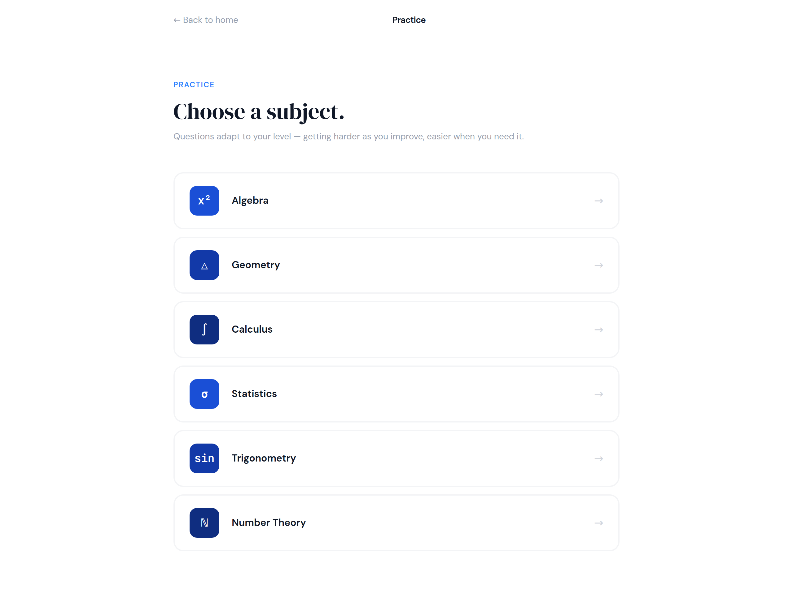
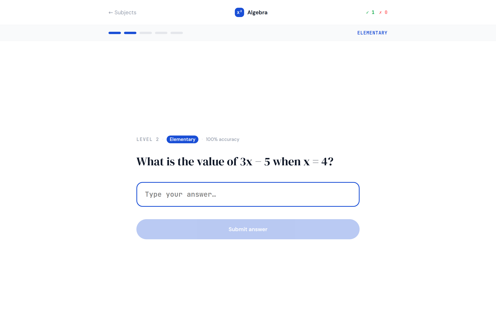
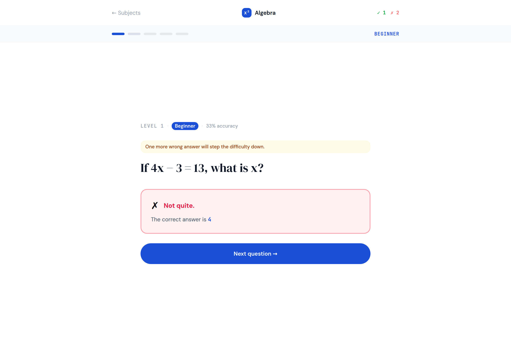

# 4. Practice and the subject quiz

No em dashes anywhere in this document or any copy it generates.

Two forms. `Practice` is a list of six subjects; `SubjectQuiz` is the adaptive
quiz for one of them. The quiz screen is the placement screen with a different
top and a level strip, so if page 3 is built, most of this page already is.

## Practice



| Name | Type | Text | Look |
|---|---|---|---|
| `lnk_back` | Link | `← Back to home` | foreground `#9ca3af`, 14 |
| `lbl_title` | Label | `Practice` | bold, 14, align center |
| `lbl_eyebrow` | Label | `PRACTICE` | role `eyebrow`, foreground `#3b82f6` |
| `lbl_heading` | Label | `Choose a subject.` | role `display`, 40 |
| `lbl_sub` | Label | `Questions adapt to your level, getting harder as you improve, easier when you need it.` | foreground `#9ca3af`, 14 |
| `rp_subjects` | RepeatingPanel | | item template `SubjectRow` |

**`SubjectRow` is the same form as on the home screen.** One row form, two
panels pointing at it. That is not a shortcut, it is the point of a row form:
the design's two lists are the same six things, so the app has one row.

The design shows a slimmer row here, icon and name and an arrow, without the
description. If you want that, the row form can be told which screen it is
on and hide `lbl_subject_description` and `fp_subject_foot` with Pattern 14.
Or leave the description in on both. Either is fine.

Clicking a subject name is the row's job, which is Pattern 1 on the Link:

```python
@handle("lnk_subject", "click")
def lnk_subject_click(self, **event_args):
    open_form('SubjectQuiz', subject=self.item['name'])
```

## SubjectQuiz



### The nav and the level strip

Two rows across the top. The first is the same three across as the placement
test; the second is a pale strip with the level in it.

| Name | Type | Text | Look |
|---|---|---|---|
| `lnk_back` | Link | `← Subjects` | foreground `#9ca3af`, 14 |
| `fp_subject` | FlowPanel | | in the middle |
| `lbl_subject_icon` | Label, inside | `x²` | role `subject-icon`, background Primary. Or bold Primary text. |
| `lbl_subject_name` | Label, inside | `Algebra` | bold, 14 |
| `fp_tally` | FlowPanel | | align right |
| `lbl_correct` | Label, inside | `✓ 1` | role `mono`, bold, 12, foreground `#16a34a` |
| `lbl_wrong` | Label, inside | `✗ 0` | role `mono`, bold, 12, foreground `#f87171` |
| `card_level_strip` | ColumnPanel | | background `#f9fafb`, one row, two things across |
| `lbl_level_dots` | Label, inside | `●●○○○` | foreground Primary, 14, letter spacing wide |
| `lbl_level_name` | Label, inside | `ELEMENTARY` | role `eyebrow` and `mono`, foreground Primary, align right |

The five little bars in the design are five rounded rectangles. Five dots in a
label say the same thing and cost one line:

```python
LEVELS = ["", "Beginner", "Elementary", "Intermediate", "Advanced", "Expert"]

self.lbl_level_dots.text = "●" * self.level + "○" * (5 - self.level)
self.lbl_level_name.text = LEVELS[self.level].upper()
```

### The question

The same components as the placement test, with a different badge line above
the question.

| Name | Type | Text | Look |
|---|---|---|---|
| `fp_badge` | FlowPanel | | |
| `lbl_level_number` | Label, inside | `LEVEL 2` | role `eyebrow` and `mono`, foreground `#9ca3af` |
| `lbl_level_chip` | Label, inside | `Elementary` | role `chip`, background Primary, foreground On Primary |
| `lbl_accuracy` | Label, inside | `100% accuracy` | foreground `#9ca3af`, 12. Hidden until one question is answered. |
| `lbl_tip` | Label | see below | role `correct` or `wrong` or a bare `#fefce8` background, 12. Hidden until an answer is in. |
| `lbl_question` | Label | `What is the value of 3x − 5 when x = 4?` | role `display`, 30 |
| `txt_answer` | TextBox | placeholder `Type your answer…` | role `answer` and `mono`, 18 |
| `dd_choice` | DropDown | | role `answer` |
| `btn_submit` | Button | `Submit answer` | role `pill`, background Primary, foreground On Primary, full width |
| `card_feedback`, `lbl_feedback_title`, `lbl_feedback_answer` | as page 3 | | |
| `btn_next` | Button | `Next question →` | role `pill`, full width |

The design colours the whole quiz by subject: the submit button, the chip and
the level bars are Algebra blue on Algebra and a darker blue on Calculus. They
are three shades of the same blue. Use Primary for all six subjects and nobody
will notice, least of all the person answering.

### Accuracy, and the tip

Two small things that make the screen feel alive, and both are one line of
arithmetic:

```python
answered = self.correct + self.wrong
if answered:
    self.lbl_accuracy.text = f"{round(100 * self.correct / answered)}% accuracy"
    self.lbl_accuracy.visible = True
```

The tip sits above the question after an answer and says what the level is
about to do. Three messages, from the design:

```python
if was_right:
    self.lbl_tip.text = "Great job! Moving up a level →"
    self.lbl_tip.role = "correct"
elif self.wrong_streak >= 2:
    self.lbl_tip.text = "Stepping back a level to build confidence."
    self.lbl_tip.role = "wrong"
else:
    self.lbl_tip.text = "One more wrong answer will step the difficulty down."
    self.lbl_tip.role = None
    self.lbl_tip.background = "#fefce8"
    self.lbl_tip.foreground = "#92400e"
self.lbl_tip.visible = True
```

Check that against your own level code: the tip has to be worked out **before**
the streak is reset to zero, or the "stepping back" message can never show.
That is exactly what happens in the Figma, where the yellow "one more wrong
answer" message appears on the answer that just stepped you down. Yours can
be right where the design is wrong.



## The three states

**Empty.** Practice has no empty state; the six subjects are fixed. The quiz
opens on a level 1 question with `✓ 0  ✗ 0`, one dot filled, and no accuracy
and no tip. Start those two labels invisible in the designer.

**Wrong.** Submit with nothing typed, same as page 3. The design disables the
button; you `alert` and `return`.

**Full.** A student who has answered forty questions in one subject. Level 5
has four questions, so the same ones come round again, which the design handles
by reshuffling. The tally and the accuracy keep counting up, and nothing on the
screen gets wider, so nothing breaks.

## Test it

1. Open Algebra. Level 1, one dot, `Beginner`, no accuracy, no tip.
2. Get one right. Green box, `✓ 1`, the tip says moving up, and the next
   question is level 2 with two dots.
3. Get two wrong in a row. `✗ 2`, and you are back on level 1 with one dot.
4. The accuracy after those three is `33% accuracy`.
5. `← Subjects` goes back to the list, and the list still has six.
