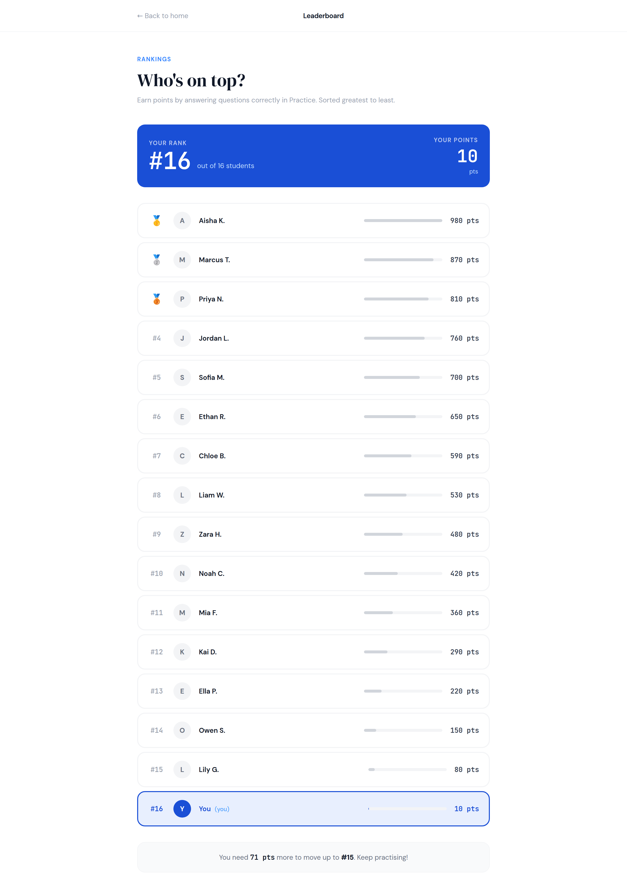
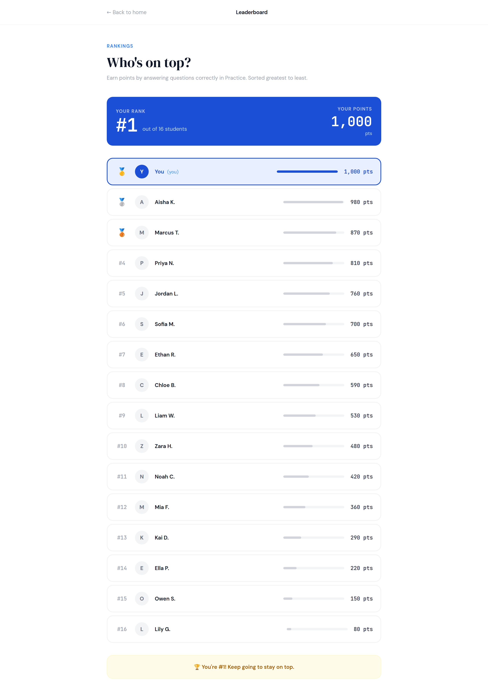

# 5. Leaderboard

No em dashes anywhere in this document or any copy it generates.



One form, `Leaderboard`, and one row form, `RankRow`. Your architecture page
already has `rp_ranks` with `lbl_rank_name` and `lbl_rank_xp`; the design adds
a rank number, a medal for the top three, an initial in a circle, and a card
at the top that says where you are. `lbl_rank_xp` is called `lbl_rank_points`
below, because your Figma says points; keep whichever name your app has.

## The top of the page

| Name | Type | Text | Look |
|---|---|---|---|
| `lnk_back` | Link | `← Back to home` | foreground `#9ca3af`, 14 |
| `lbl_title` | Label | `Leaderboard` | bold, 14, align center |
| `lbl_eyebrow` | Label | `RANKINGS` | role `eyebrow`, foreground `#3b82f6` |
| `lbl_heading` | Label | `Who's on top?` | role `display`, 40 |
| `lbl_sub` | Label | `Earn points by answering questions correctly in Practice. Sorted greatest to least.` | foreground `#9ca3af`, 14 |

## Your rank card

A ColumnPanel `card_rank`, role `panel`, background Primary, with one row of
two halves: your rank on the left, your points on the right.

| Name | Type | Text | Look |
|---|---|---|---|
| `lbl_your_rank_word` | Label | `YOUR RANK` | role `eyebrow`, foreground On Primary |
| `lbl_your_rank` | Label | `#16` | role `mono`, bold, **44**, foreground On Primary |
| `lbl_out_of` | Label | `out of 16 students` | foreground `#bfdbfe`, 14 |
| `lbl_your_points_word` | Label | `YOUR POINTS` | role `eyebrow`, foreground On Primary, align right |
| `lbl_your_points` | Label | `10` | role `mono`, bold, 36, foreground On Primary, align right |
| `lbl_pts` | Label | `pts` | foreground `#bfdbfe`, 12, align right |

## The rows

`rp_ranks`, a RepeatingPanel with `RankRow` as its item template. Each row is a
ColumnPanel `card_row`, role `card`, holding one FlowPanel `fp_row` with five
things across it:

| Name | Type | Text | Look |
|---|---|---|---|
| `lbl_rank` | Label | `🥇` or `#4` | role `mono`, bold, 14, foreground `#9ca3af` |
| `lbl_avatar` | Label | `A` | role `avatar` (optional). Or bold `#6b7280` text. |
| `lbl_rank_name` | Label | `Aisha K.` | bold, 14, foreground On Surface |
| `lbl_rank_points` | Label | `980 pts` | role `mono`, bold, 14, foreground `#374151`, align right |

The grey bar between the name and the points, longer for more points, is a
rectangle whose width is a percentage. There is no component that does that,
and the number next to it already says it. Skip the bar.

The row fills itself in `__init__`, and this is where the design's little
touches live:

```python
MEDALS = {1: "🥇", 2: "🥈", 3: "🥉"}

rank = self.item['rank']
self.lbl_rank.text = MEDALS.get(rank, f"#{rank}")
self.lbl_avatar.text = self.item['name'][0]
self.lbl_rank_name.text = self.item['name']
self.lbl_rank_points.text = f"{self.item['points']:,.0f} pts"

if self.item['is_you']:
    self.card_row.role = "card-you"
    self.lbl_rank.foreground = "#1a4fd6"
    self.lbl_rank_name.foreground = "#1a4fd6"
    self.lbl_rank_name.text = f"{self.item['name']}  (you)"
    self.lbl_rank_points.foreground = "#1a4fd6"
```

`MEDALS.get(rank, f"#{rank}")` reads as: the medal for this rank, or `#4` if
there is no medal for it. One line instead of an `if`, and worth knowing.

### Where `rank` and `is_you` come from

A table row does not know its own rank; rank is where the row landed after the
sort. So `Leaderboard` works it out before it hands the list to the panel,
which is the same idea as the Cuisinely order screen: build your own list of
dictionaries with the extra facts in it.

```python
rows = anvil.server.call('get_leaderboard')     # Pattern 11: highest points first

entries = []
for position, row in enumerate(rows, start=1):
    entries.append({
        'rank': position,
        'name': row['name'],
        'points': row['points'],
        'is_you': row['name'] == my_name,
    })

self.rp_ranks.items = entries
```

`enumerate(rows, start=1)` counts the rows for you, starting at 1 rather than
0, which is what a rank is. `my_name` is however your app knows who is using
it: whatever you typed on the home screen, or the signed in user.

## The footer

Under the list, one label in a pale box, and it says a different thing
depending on where you are.

| Name | Type | Text | Look |
|---|---|---|---|
| `lbl_footer` | Label | see below | align center, 14, role `card`, background `#f9fafb` |

```python
mine = [e for e in entries if e['is_you']]
if not mine:
    self.lbl_footer.text = "Type your name on the home screen to see your rank."
elif mine[0]['rank'] == 1:
    self.lbl_footer.text = "🏆 You're #1! Keep going to stay on top."
    self.lbl_footer.background = "#fefce8"
    self.lbl_footer.foreground = "#a16207"
else:
    me = mine[0]
    above = entries[me['rank'] - 2]
    needed = above['points'] - me['points'] + 1
    self.lbl_footer.text = f"You need {needed:,.0f} pts more to move up to #{me['rank'] - 1}. Keep practising!"
```

`entries[me['rank'] - 2]` is the person one place above you. Rank 16 is at
position 15 in a list that starts at 0, so the one above is at 14, which is
rank minus two. Work it through once on paper and it stops being strange.



## The three states

**Empty.** No rows in the table. The panel shows nothing and the rank card
would say `#0 out of 0`. Say something instead: if `entries` is empty, set
`lbl_footer` to `Nobody has any points yet. Be the first: go and practise.`
and hide `card_rank`. On the first day this is the only state anybody sees.

**Wrong.** Nothing to type on this screen. The wrong state is a student who
never typed a name, and the footer's first line covers it.

**Full.** Thirty students and a name like `Maximilian Featherstonehaugh`. A
FlowPanel wraps a long name on to a second line rather than pushing the points
off the edge. Check it with one long name in the table before you trust it.

## Test it

1. With the fifteen made up students from the design in your table and you on
   10 points, you are `#16 out of 16`, at the bottom, with a blue border.
2. The top three have medals, everyone else has `#4`, `#5`, and so on.
3. The footer says you need `71 pts` to reach `#15`, which is Lily's 80, minus
   your 10, plus 1.
4. Give yourself 1,000 points. You are `#1`, the footer turns gold, and the
   points show as `1,000 pts` with the comma.
5. Empty the table. The screen says so, and nothing goes red.
